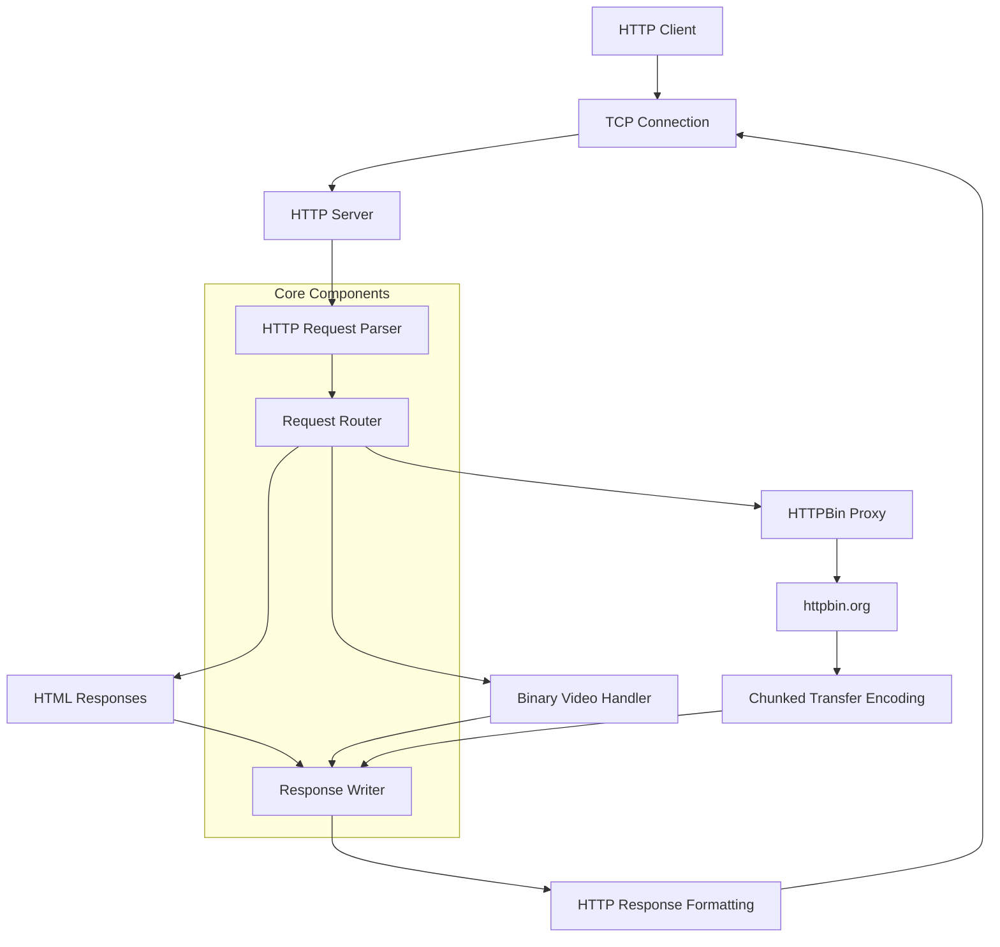

# HTTP/1.1 Server in Go

Learning Golang, decided to implement an http/1.1 server in Go

## Start

```bash
# Clone the repository
git clone https://github.com/danishjuneja/http-server-go.git
cd http-server-go

# Run the server
go run ./cmd/httpserver

# Test it out!
curl http://localhost:42069/
curl http://localhost:42069/video
curl http://localhost:42069/httpbin/stream/100
```

Visit `http://localhost:42069` in your browser to see the server in action!

## 🏗️ Architecture Overview


